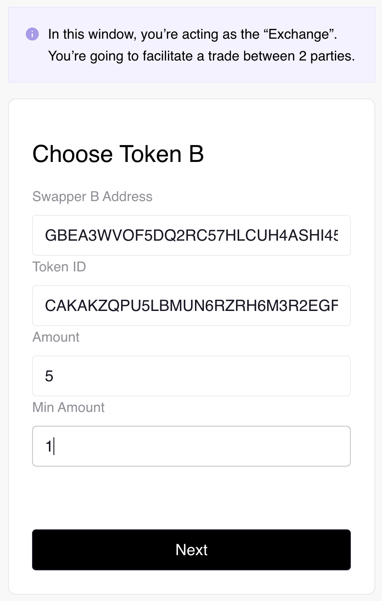
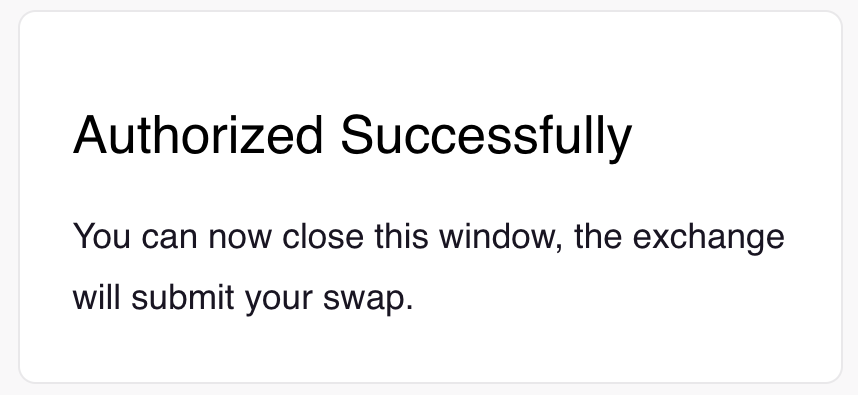
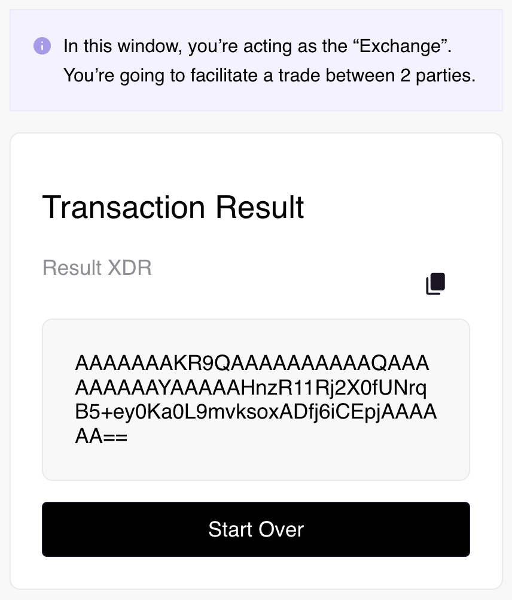

# Soroban React Atomic Swap

The Atomic Swap DApp is a simplified demo of a dapp that performs an atomic
operation to swap 2 potentially different amounts of 2 tokens between 2 separate
parties, optionally signed and submitted by a third party.

## Prerequisites

The Atomic Swap DApp relies on the following dependencies:

- Node (>=16.14.0 <=18.0.0): https://nodejs.org/en/download/

- Yarn (v1.22.5 or newer): https://classic.yarnpkg.com/en/docs/install

- Freighter wallet(v5.0 or newer): https://www.freighter.app/

You need access to/funds from the following contracts - Atomic Swap:
https://github.com/stellar/soroban-examples/tree/main/atomic_swap Token:
https://github.com/stellar/soroban-examples/tree/main/token

This demo involves a minimum of 2 parties and 2 different tokens to swap between
the parties.

## Features

The Atomic Swap DApp offers the following features:

1. **Freighter Wallet Integration**: The Atomic Swap DApp seamlessly integrates
   with Freighter/Albedo/XBull, allowing users to connect their wallet to access
   Soroban token balances and utilize their signing capabilities for secure and
   integrity-checked transactions.

2. **Transaction Construction**: Leveraging the Soroban atomic swap contract
   interface, the DApp constructs transactions that invoke the `swap` method of
   the
   [swap interface](https://github.com/stellar/soroban-examples/blob/main/atomic_swap/src/lib.rs#L16).
   This method facilitates an atomic swap operation on the Soroban network.

## Getting Started

To use the Atomic Swap DApp, follow these steps:

1. Install and set up one of the supported wallets.

- [Freighter wallet](https://www.freighter.app/)
- [Albedo wallet](https://albedo.link/install-extension)
- [XBull wallet](https://xbull.app/)

2. Clone and navigate into the
   [Atomic Swap DApp repository](https://github.com/stellar/soroban-react-atomic-swap/tree/main)
   by running the following:

   ```
   git clone https://github.com/stellar/soroban-react-atomic-swap.git
   cd soroban-react-atomic-swap
   ```

3. Install the dependencies by running the following:

   ```
   yarn
   ```

4. Deploy the Atomic Swap smart contracts.

For this step you will need to clone and deploy the
[Atomic Swap smart contract](https://github.com/stellar/soroban-examples/blob/main/atomic_swap/src/lib.rs).
The Atomic Swap smart contract is a custom contract that will be used to
facilitate swaps in the Atomic Swap Dapp.

In a new terminal window, follow the steps below to build and deploy the smart
contracts:

```bash
git clone https://github.com/stellar/soroban-examples.git
cd soroban-examples/atomic_swap
make
```

This will build the smart contracts and put them in the
`atomic_swap/target/wasm32-unknown-unknown/release` directory.

Next, you will need to deploy the smart contracts to Futurenet. To do this, open
a terminal in the `soroban-examples/atomic_swap` directory and follow the steps
below:

```bash
soroban contract deploy \
    --wasm target/wasm32-unknown-unknown/release/soroban_atomic_swap_contract.wasm \
    --source <ADMIN_ACCOUNT_SECRET_KEY> \
    --rpc-url https://rpc-futurenet.stellar.org:443 \
    --network-passphrase 'Test SDF Future Network ; October 2022'
```

This will return a contract id that we will need to use later on.

```bash
# Example output used for ATOMIC_SWAP_CONTRACT_ID
CCWXGZ6PCOORP7UKO2GVYS5PFYR4BND4XDYTQMO2B32SKXVX4DUKUUZ6
```

5. Deploy the Soroban token smart contracts.

For this step you will need to clone and deploy the
[Soroban token smart contracts](https://github.com/stellar/soroban-examples/blob/main/token/src/contract.rs).
The Soroban tokens are custom tokens that will be swapped in the Atomic Swap
Dapp.

Open a new terminal window in the `soroban-examples` directory and follow the
steps below to build and deploy the smart contracts:

```bash
cd token
make
```

This will build the smart contracts and put them in the
`token/target/wasm32-unknown-unknown/release` directory.

Next, you will need to deploy the smart contracts to Futurenet. To do this,
follow the steps below:

```bash
soroban contract deploy \
    --wasm target/wasm32-unknown-unknown/release/soroban_token_contract.wasm \
    --source <ADMIN_ACCOUNT_SECRET_KEY> \
    --rpc-url https://rpc-futurenet.stellar.org:443 \
    --network-passphrase 'Test SDF Future Network ; October 2022'
```

This will return a contract id that we will need to use later on.

```bash
# Example output used for TOKEN_A_CONTRACT_ID
CCZZ763JDLSHEXUFUIHIKOVAAKYU2CUXSUH5MP4MH2HDZYGOYMM3RDD5
```

```bash
soroban contract invoke \
    --id <TOKEN_A_CONTRACT_ID> \
    --source-account <ADMIN_ACCOUNT_SECRET_KEY> \
    --rpc-url https://rpc-futurenet.stellar.org:443 \
    --network-passphrase 'Test SDF Future Network ; October 2022' \
    -- initialize \
    --admin <ADMIN_PUBLIC_KEY> \
    --decimal 7 \
    --name "Demo Token A" \
    --symbol "DTA"
```

Next we will need to mint some tokens to two user account. To do this, run the
following command:

```bash
soroban contract invoke \
    --id <TOKEN_A_CONTRACT_ID> \
    --source-account <ADMIN_ACCOUNT_SECRET_KEY> \
    --rpc-url https://rpc-futurenet.stellar.org:443 \
    --network-passphrase 'Test SDF Future Network ; October 2022' \
    -- mint \
    --to <USER_A_OR_B_PUBLIC_KEY> \
    --amount 1000000000
```

Remember: You'll be deploying, initializing token contract twice, once for each
token involved in the swap so make sure to store both Contract Ids. You will
mint tokens to both users' accounts for each token contract.

After deploying and minting the first token contract using the steps outlined
above, simply repeat the process for the second token.

_See the example below for initializing and minting the second token contract_

**_Initialize_**

```bash
soroban contract invoke \
    --id <TOKEN_B_CONTRACT_ID> \
    --source-account <ADMIN_ACCOUNT_SECRET_KEY> \
    --rpc-url https://rpc-futurenet.stellar.org:443 \
    --network-passphrase 'Test SDF Future Network ; October 2022' \
    -- initialize \
    --admin <ADMIN_PUBLIC_KEY> \
    --decimal 7 \
    --name "Demo Token B" \
    --symbol "DTB"
```

**_Mint_**

```bash
soroban contract invoke \
    --id <TOKEN_B_CONTRACT_ID> \
    --source-account <ADMIN_ACCOUNT_SECRET_KEY> \
    --rpc-url https://rpc-futurenet.stellar.org:443 \
    --network-passphrase 'Test SDF Future Network ; October 2022' \
    -- mint \
    --to <USER_A_OR_B_PUBLIC_KEY> \
    --amount 1000000000
```

6. [Enable and add Soroban Tokens](https://soroban.stellar.org/docs/reference/freighter#enable-soroban-tokens)
   in Freighter.

7. In the `soroban-react-atomic-swap` directory run the front end with
   `yarn start` and navigate to http://localhost:9000/ in your browser.

   ## Make a Swap

8. Connect your wallet to the Atomic Swap Dapp by clicking the "Connect Wallet"
   button. This will open a Freighter/Albedo/XBull window where you can select
   your account to connect to the Dapp.


You should see your account address in the top right corner of the screen.


2. Enter the contract id for the Atomic Swap.


3. Enter the contract id and amount for Token A you want to swap.


In this example we will swap 1 of Token A for 5 of Token B.

4. Enter Swapper B's public key and the contract id and amount for Token B you
   want to swap.



In this example we will swap 5 of Token B for 1 of Token A.

5. Click the "Build Swap" button to initiate the swap.


This will open a another window in your browser where you will be prompted to
sign the transaction with user A's and user B's accounts.


6. Click the "Connect Wallet" button in the new window to connect user A's
   account to the Dapp.

7. Click the "Sign with Wallet" button to sign the transaction with user A's
   account.


> Note: If you are using the address of the account that initiated the swap, you
> may notice that there is no window to sign the transaction. This is because we
> are using a previously authorized account to sign the transaction.. TODO: Add
> more info about this.

8. Switch to user B's account in Freighter/Albedo/XBull and click the "Connect
   Wallet" button in the new window to connect user B's account to the Dapp.

9. Click the "Sign with Wallet" button to sign the transaction with user B's
   account. This will authorize the swap and display a success message.



10. Switch back to previous tab and click the "Sign with Wallet & Sumbit" button
    to submit the swap to the network.


11. You should see a "Transaction Result" message and the swap should be
    complete!



Congratulations! You have successfully completed an Atomic Swap using Soroban!
🎉

If you have any questions or issues, please reach out to us on
[discord](https://discord.com/channels/897514728459468821/1037073682599780494)
or file an issue on github.
